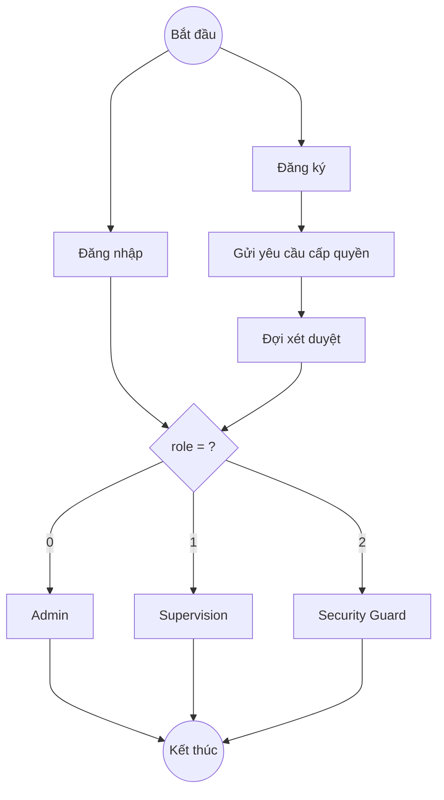

```mermaid
flowchart TD
	A((Bắt đầu)) 
	B[Đăng nhập]
	C[Đăng ký]
	D{role = ?}
	E[Admin]
	F[Supervision]
	G[Security Guard]
	H[Gửi yêu cầu cấp quyền]
	I[Đợi xét duyệt]
	K((Kết thúc))
	A ---> B
	A ---> C
	B ---> D
	C --> H
	H --> I --> D
	D --0---> E ---> K
	D --1---> F ---> K
	D --2---> G ---> K
```

