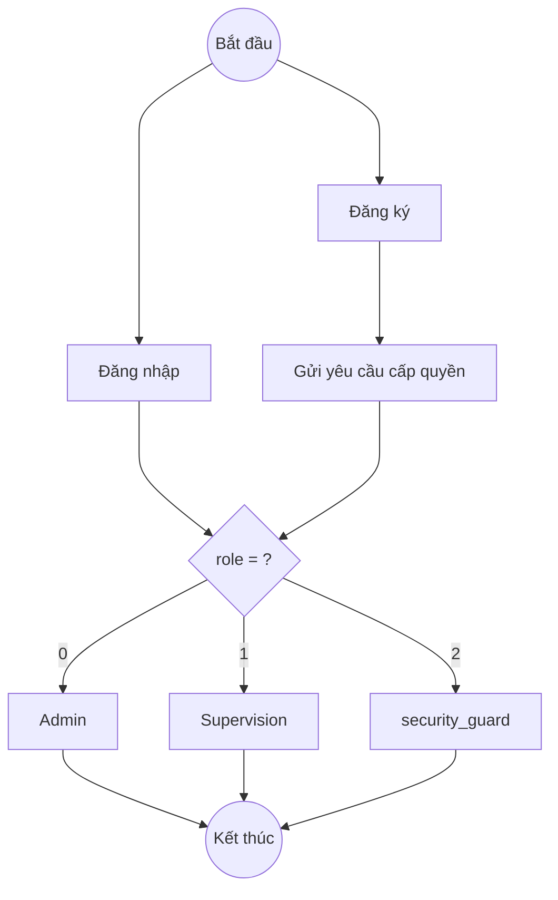

```mermaid
flowchart TD
	A((Bắt đầu)) 
	B[Đăng nhập]
	C[Đăng ký]
	D{role = ?}
	E[Admin]
	F[Supervision]
	G[security_guard]
	H[Gửi yêu cầu cấp quyền]
	I((Kết thúc))
	A ---> B
	A ---> C
	B ---> D
	C ---> H
	H ---> D
	D --0--> E --> I
	D --1--> F --> I
	D --2--> G --> I
```

