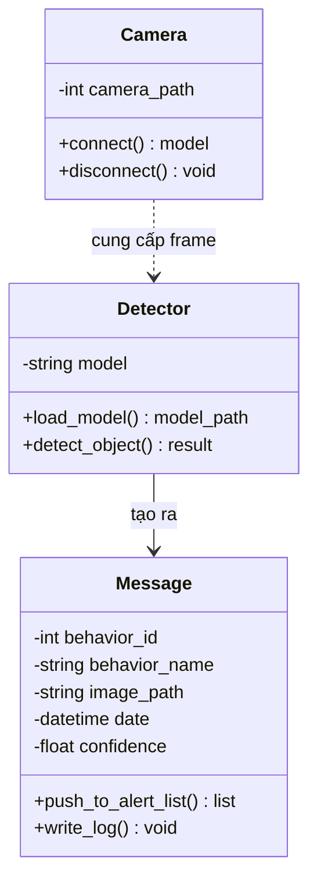
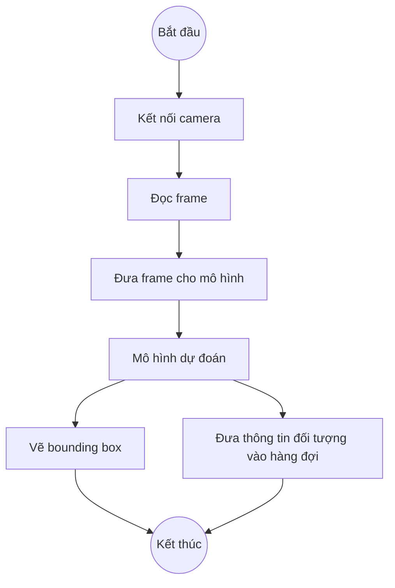

```mermaid
classDiagram
    class Detector {
        -string model
        +load_model() model_path
        +detect_object() result
    }
    class Camera {
	    -int camera_path
	    +connect() model
	    +disconnect() void
    }
    class Message {
	    -int behavior_id
	    -string behavior_name
	    -string image_path
	    -datetime date
	    -float confidence
	    +push_to_alert_list() list
	    +write_log() void
    }
    
    
	Camera ..> Detector : cung cấp frame 
	Detector --> Message : tạo ra 
	
```

```mermaid
flowchart TD
	A((Bắt đầu))
	B[Kết nối camera]
	C[Đọc frame]
	D[Đưa frame cho mô hình]
	E[Mô hình dự đoán]
	F[Vẽ bounding box]
	G[Đưa thông tin đối tượng vào hàng đợi]
	H((Kết thúc))
	A --> B --> C --> D -->E
	E --> F --> H
	E --> G --> H
```
