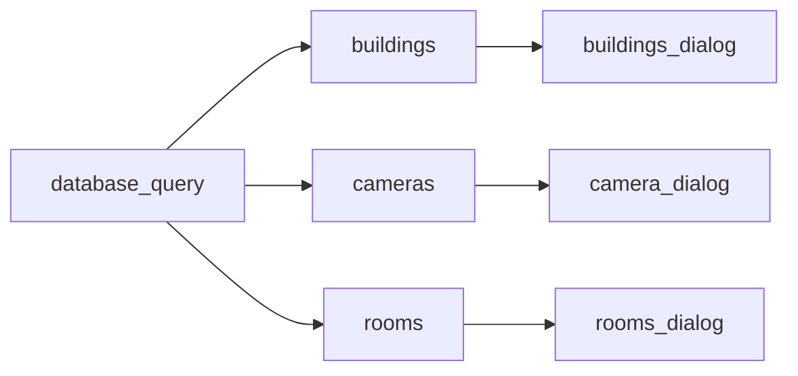

Chức năng CRUD

```mermaid
graph LR
A[database_query] --> B[buildings] --> E[buildings_dialog]
A[database_query] --> C[cameras] --> F[camera_dialog]
A[database_query] --> D[rooms] --> G[rooms_dialog]

```
