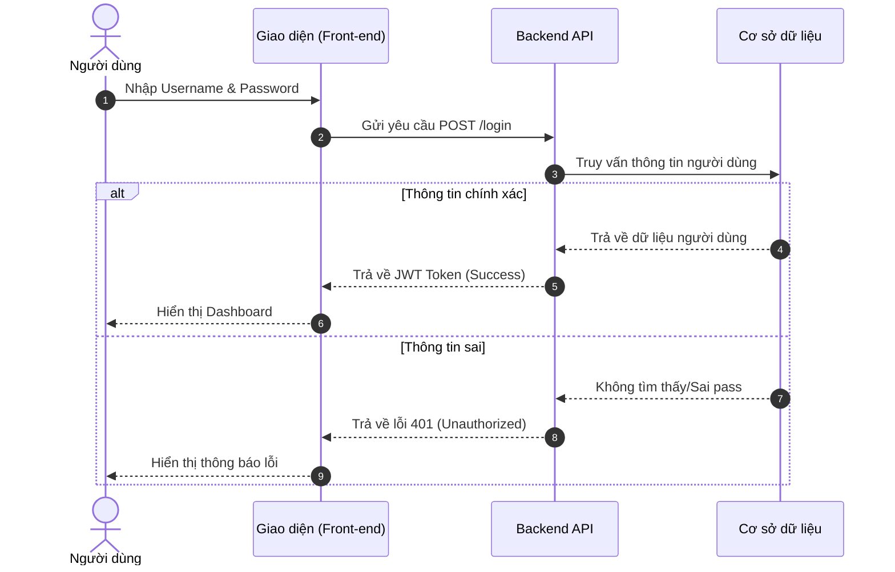

Chức năng CRUD

```mermaid
sequenceDiagram
    autonumber
    actor User as Người dùng
    participant UI as Giao diện (Front-end)
    participant API as Backend API
    participant DB as Cơ sở dữ liệu

    User->>UI: Nhập Username & Password
    UI->>API: Gửi yêu cầu POST /login
    API->>DB: Truy vấn thông tin người dùng
    
    alt Thông tin chính xác
        DB-->>API: Trả về dữ liệu người dùng
        API-->>UI: Trả về JWT Token (Success)
        UI-->>User: Hiển thị Dashboard
    else Thông tin sai
        DB-->>API: Không tìm thấy/Sai pass
        API-->>UI: Trả về lỗi 401 (Unauthorized)
        UI-->>User: Hiển thị thông báo lỗi
    end
```
